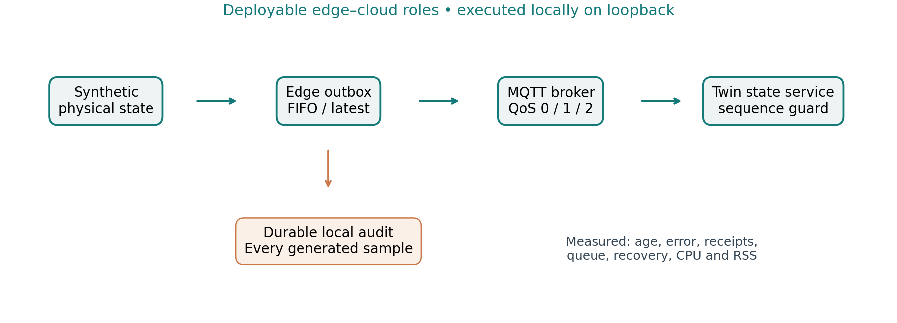
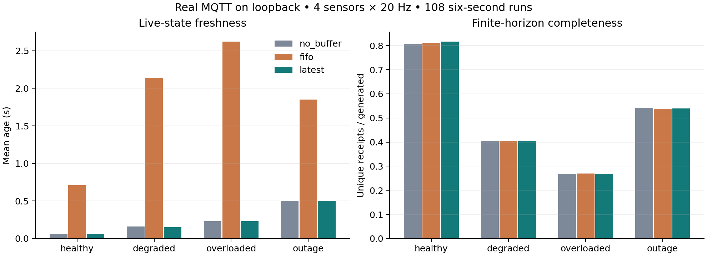
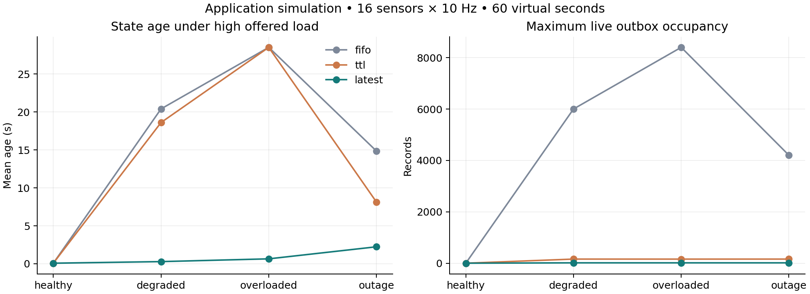
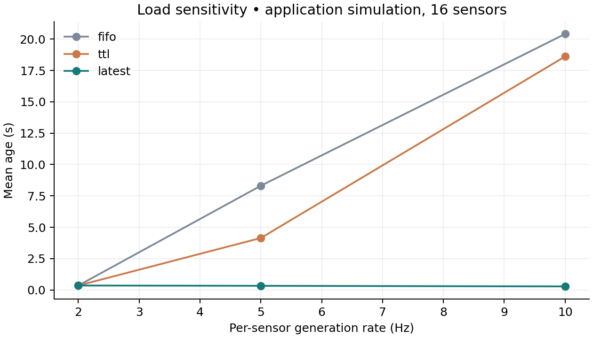

# Freshness-aware edge replay for MQTT digital-twin synchronization

## Final research-phase reproduction and methodology report

Prepared 7 October 2026 • Cloud Computing research project • Muhammad Sameer and Humayun Bilal (proposal team names; authorship/contributions require human confirmation).

**Status:** executed local research package and preliminary manuscript material. Exact original-paper numerical reproduction, remote cloud validation and instructor approval remain open. This PDF is not the final instructor-template Overleaf manuscript.

## Abstract

Buffered telemetry can preserve a replay opportunity while leaving a digital twin's current state stale. We audit and execute the feasible MQTT core of a recent communication-monitoring study, then evaluate fair latest-state coalescing with a sequence-checked receiver and separate durable local history. The empirical package contains 108 actual MQTT loopback runs across three QoS levels and four application-shaped uplink conditions, plus 1,200 application-simulation executions across load, scale and policy variations. In the live outage condition, mean Age of Information decreases from 1.852 s with FIFO to 0.503 s with the proposed policy (72.8%); finite-horizon delivery remains approximately 53.9%. A fair epoch-only baseline reaches similar freshness in short live tests, so universal superiority is not claimed. Every generated live sample is preserved locally; intermediate updates are not all delivered remotely. Removing the receiver guard causes 5,945 regressions across the unguarded simulation runs. The results support distinguishing current-state freshness from traffic rate and history completeness. They do not establish packet-loss resilience, production durability, attack-classification accuracy or public-cloud performance.

Reproducibility: The code and reproducibility materials for this study are publicly available at: https://github.com/SMR202/dt-mqtt-resilience

## 1. Problem, motivation and contribution

A twin receiving old updates can appear active while its state is obsolete. For a current-state service, replay order and per-device coverage matter in addition to communication reliability. We investigate this application-layer trade-off within the existing Digital Twin + cloud/MQTT project. The cloud component is an independently deployable MQTT subscriber/current-state service; the executed benchmark co-locates it with the edge and broker. Physical measurements, cloud WAN deployment and billing are not part of the evidence.

Our contribution is a reproducible systems experiment combining committed local audit history, per-device latest-state coalescing, round-robin dispatch and a monotonic receiver. These elements are established techniques. We claim a scoped implementation/evaluation contribution and a paper/code reproducibility audit; no theoretical novelty or globally optimal scheduling result is asserted.

## 2. Reference selection and initial reproduction

The selected reference is Rodrigues et al., *A Data Rate Monitoring Approach for Cyberattack Detection in Digital Twin Communication*, Sensors 25(24), 7476 (2025), DOI 10.3390/s25247476. The official artifact is pinned to commit `43346f60a9f41392611242ff3cb7589d7a758aa7`. The full selection rationale, original environment/settings and rejected alternatives are in the initial audit. That audit is part of this report package and avoids treating paper descriptions as executed results.

The native adapter runs original MQTT sensor, receiver and monitor function bodies, retains original calibration timing, and replaces Docker addressing and the broker. A benign telemetry burst exercises the communication-rate monitor. It is not a reproduction of the reference's attacks or packet-level numerical figures.

Measured native evidence: 283 observed MQTT events, 200 deliberately generated benign-burst messages, and 92.82 s elapsed. The observed burst is 16.37 application messages/s. The independent paper-rule implementation, calibrated on this run's observed sensor-message bins, yields 3.235 messages/s; the observer maximum is 4. The original monitor's own device-to-twin calibration maximum is 3. Observer and monitor windows/capture boundaries differ, so their thresholds need not match.

The first native attempt failed to activate calibration because its completion message did not arrive. The repaired adapter resends only that missing control message using a running network loop and QoS1; this was required in the successful run as well. UTF-8 logging is another native adaptation. Failed logs, successful logs, source hashes and message events remain inspectable. Code inspection also found the maximum-threshold rule, unpinned dependencies, Paho API/version disagreement and the difference between application counters and wire PPS/BPS. None of the published Table 2 values is presented as a measurement of this run.

## 3. Literature-grounded gap and research question

The 16-paper literature matrix covers platform integration, cloud processing, network-aware twins, operational resilience, synchronization budgets, AoI/AoDT, scheduling and reproducible benchmarks. It explicitly includes prior freshness optimization. A statement that digital-twin research has ignored freshness would be indefensible. The selected rate-oriented artifact, however, lacks generation-age-aware current-state application and a fair recovery outbox. Whether its traffic-rate signals reflect useful current-state recovery is therefore untested in that implementation.

RQ: Under constrained edge dispatch and temporary disconnection, how does fair latest-state coalescing with monotonic application compare with FIFO replay and expiry in state age, error, delivery completeness and resource cost?

Objectives are to reproduce the feasible core with an honest audit; implement and preserve matched baseline/proposed policies; quantify freshness/completeness/recovery/resources; and test expiry and receiver-guard ablations. The complete thematic synthesis, review-depth labels and citations are in `docs/LITERATURE_REVIEW.md`.

## 4. Methodology

Messages contain device ID, increasing sequence number, nominal generation time and an analytically known state value. Current state is `sin(0.3*t+device)`. No learned model or physical process prediction is used. The receiver's held value and generation time are compared with current analytical ground truth.

AoI is time since the latest applied update was generated. Mean and p95 AoI use device-time observations after warm-up. Stale fraction uses a one-second threshold chosen for this experiment. MAE is unitless held-state error. Delivery ratio divides unique received updates by all generated updates, including intentionally suppressed ones. Synchronization latency includes edge waiting. Recovery requires every device's age to return to at most one second; unrecovered runs are censored rather than silently omitted.

FIFO preserves queued updates in order. Epoch-only staging drops old eligible work and rotates live sensor emission priority. Expiry drops queued updates older than one second in the simulation. The proposal persists all samples in a local audit table and retains only each device's newest queued live update. Round-robin service avoids permanent device priority. A sequence guard rejects duplicate/older application updates. The guard ablation changes only receiver acceptance.

SQLite uses WAL/FULL synchronization and non-reused outbox IDs. Publication-complete acknowledgement precedes deletion, preventing an old acknowledgement from deleting a new replacement. MQTT publisher completion is not a cloud-state commit acknowledgement. The local audit is not delivered to a cloud archive. Commands/events requiring lossless history are outside latest-value coalescing semantics.

## 5. Experimental design and environment

The live design contains 108 runs: three seeds × QoS 0/1/2 × healthy/degraded/overloaded/outage × epoch-only/FIFO/latest. Each runs six measured seconds after subscriber setup; one second is excluded from freshness metrics. Four devices generate 20 Hz each. Nominal dispatch caps are 160, 60, 30 and 120 messages/s; configured application delay/jitter and a no-dispatch interval from 1.5 to 3.5 seconds complete the scenarios. Already-published messages may drain after the finite horizon; unsent outbox backlog does not. Nominal service caps do not guarantee achieved throughput because disk commits, acknowledgement waits and Windows scheduling consume time.

The simulation contains 1,200 runs: four/sixteen devices × 2/5/10 Hz × four conditions × ten seeds × five policies. Duration is 60 virtual seconds with five seconds excluded. Its synthetic delay/jitter is keyed by message ID and seed for matched randomness. This model does not implement TCP or MQTT handshakes and is never used to infer simulated QoS packet-loss behavior. Seed-zero raw events are retained for every condition, with per-run records for all repetitions.

Executed host: Windows build 26200, AMD64 family 23/model 8, six physical/twelve logical CPUs, approximately 15.93 GiB RAM; Python 3.10.9, Paho 2.1.0, AMQTT 0.11.3. The package/environment snapshots contain all versions. Broker/subscriber/edge use loopback. During the early live sweep, background native-core/simulation jobs ran on the shared desktop; randomized order reduces systematic policy grouping but does not eliminate host-load confounding. Costs are descriptive measurements, not isolated broker benchmark claims.

## 6. Actual MQTT results

The following table averages QoS within each seed before summarizing seeds. Full QoS-specific tables and paired differences are included in the processed results.

| Scenario | Policy | Mean age (s) | p95 age (s) | Delivery (%) | MAE |
| --- | --- | --- | --- | --- | --- |
| degraded | fifo | 2.138 | 3.469 | 40.49 | 0.408 |
| degraded | latest | 0.152 | 0.229 | 40.56 | 0.028 |
| degraded | no_buffer | 0.162 | 0.254 | 40.53 | 0.030 |
| healthy | fifo | 0.709 | 1.139 | 81.04 | 0.128 |
| healthy | latest | 0.056 | 0.094 | 81.62 | 0.010 |
| healthy | no_buffer | 0.062 | 0.124 | 80.72 | 0.011 |
| outage | fifo | 1.852 | 2.770 | 53.87 | 0.349 |
| outage | latest | 0.503 | 1.868 | 53.91 | 0.098 |
| outage | no_buffer | 0.502 | 1.868 | 54.21 | 0.096 |
| overloaded | fifo | 2.621 | 4.250 | 26.94 | 0.502 |
| overloaded | latest | 0.232 | 0.350 | 26.88 | 0.043 |
| overloaded | no_buffer | 0.232 | 0.356 | 26.81 | 0.043 |

The proposed policy reduces outage mean age by 72.8% against FIFO. It restores the all-device one-second age criterion in about 0.120 s after reconnection; all nine FIFO outage runs remain unrecovered at the measurement horizon. This is recovery of held current state, not backlog clearance or complete remote history.

The fair epoch-only baseline matches or slightly exceeds latest-state freshness in the outage/overloaded conditions. Its lack of historical replay is acceptable for this short current-state workload but cannot satisfy a cloud history-completeness requirement. The proposal adds local history and persistence of queued latest state; the current experiment does not demonstrate improved remote archive completeness over that baseline. Differences between QoS levels on this local path do not establish WAN reliability advantages.

Even the nominal healthy condition does not transmit every generated update within the finite horizon. The actual native service rate is limited by desktop scheduling/storage and implementation overhead. The FIFO age gap in healthy runs therefore reflects a measured end-to-end application bottleneck, not intrinsic healthy-network MQTT latency.

## 7. Simulation sensitivity and ablation

At the largest offered load (16 devices × 10 Hz), the complete policy comparison is:

| Scenario | Policy | Mean age (s) | Delivery (%) | Max queue |
| --- | --- | --- | --- | --- |
| degraded | fifo | 20.405 | 37.43 | 6002 |
| degraded | latest | 0.283 | 37.44 | 16 |
| degraded | ttl | 18.611 | 37.43 | 162 |
| healthy | fifo | 0.074 | 99.95 | 2 |
| healthy | latest | 0.074 | 99.95 | 2 |
| healthy | ttl | 0.074 | 99.95 | 2 |
| outage | fifo | 14.855 | 56.18 | 4202 |
| outage | latest | 2.236 | 56.18 | 16 |
| outage | ttl | 8.134 | 56.18 | 162 |
| overloaded | fifo | 28.518 | 12.45 | 8401 |
| overloaded | latest | 0.648 | 12.45 | 16 |
| overloaded | ttl | 28.514 | 12.45 | 161 |

Higher load produces large FIFO age/backlog even when its receipt ratio resembles the proposal's. Expiry reduces queue size but does not reliably preserve per-device freshness in these periodic workloads. Source/service timing aliasing can select a persistent subset of devices, particularly for simulation epoch-only and expiry controls; conclusions against FIFO are stronger than comparisons to those secondary controls.

Removing the sequence guard produces 5,945 regressions across the 240 unguarded runs. The guarded proposal has none. Some conditions show zero guard benefit because they do not reorder same-device updates; all conditions, including these null cases, are retained. The count is an application-model outcome, not an MQTT protocol-violation count. Only current-state queue entries are bounded by device count; local audit storage grows with generated history.

## 8. Runtime, resource and communication costs

| Policy | CPU seconds/run | Runner RSS (MiB) | Broker RSS (MiB) | Payload bytes/run |
| --- | --- | --- | --- | --- |
| fifo | 0.576 | 28.98 | 4.73 | 18541 |
| latest | 0.579 | 29.07 | 4.73 | 18871 |
| no_buffer | 0.551 | 29.02 | 4.72 | 18807 |

Values average all final live runs for each policy. CPU seconds include runner threads/SQLite/sampling, but exclude broker CPU and setup/drain. RSS values are means of sampled per-run peaks. Payload bytes exclude protocol headers/acknowledgements and cannot be called wire bandwidth. The simulation consumes 277.02 measured process CPU seconds and 291.28 wall seconds across its 1,200 runs; each run advances 60 virtual seconds.

The proposal's live queue maximum is four rows; FIFO reaches 353 rows. Comparable average runner RSS/CPU are measured on this host, not evidence of negligible overhead on embedded hardware. Every method uses the common audit path, so the epoch-only baseline is not a minimal publisher implementation. No watts, joules, cloud spend or disk-lifetime claim is made.

## 9. Verification, integrity and evidence

Raw-event and compressed-database checks independently verify 51,840 generated updates, 26,247 published updates and 26,247 received updates. All 108 database histories contain the expected unique device/sequence pairs. Independent event-integral mean age differs from sampled means by at most 0.009665 s. Six correctness tests pass for restart persistence, FIFO/TTL semantics, replacement IDs, late-ack safety, fair dispatch, receiver monotonicity and threshold differences.

Paired bootstrap intervals resample whole seed pairs, with 10,000 draws. The three-seed live intervals are exploratory, not population confidence about industrial deployment; no device-time pseudoreplication or global significance claim is used. Pilots with unfair service or earlier dispatch acknowledgement logic are excluded and explicitly labeled. Source/config/evidence SHA-256 manifests, raw traces, dependency pins and regeneration scripts accompany this report.

## 10. Limitations and remaining external work

The reference core is an adapted method reproduction, not exact numerical replication. Its original captures and full Linux/Docker attacks were not reproduced. The native source remains separately fetched because no project-level license was verified. Our application impairment is not TCP loss or a physical outage. The signal/workload is synthetic, clocks are co-located, runs are short, QoS handshakes are local, and desktop sleep resolution/storage alter service capacity. Timing/resource values vary across hosts.

Latest-value coalescing sacrifices intermediate live deliveries. A separate local audit preserves them but does not deliver them remotely. The audit currently has no retention policy. Receiver state and scheduling pointer are not persistent across processes; device epochs and end-to-end application acknowledgements are required for production restart guarantees. SQLite restart unit tests do not constitute physical power-loss tests. Overflow caps were not reached; differing live/model overflow choices are not evaluated.

Instructor/mentor confirmation, official Overleaf integration/access, group registration, human authorship/contribution review and defense remain external. Future Linux netem, actual edge/cloud deployment, archive delivery and hardware/power experiments are explicitly unexecuted. The course's final poster/presentation/submission workflow is separate from this phase report. No paper was submitted and no acceptance is implied.

## 11. Conclusion

This research-phase package reproduces a feasible official MQTT communication core, exposes important paper/code differences, and implements a measurable current-state recovery extension. Under the executed constrained conditions, coalescing materially improves freshness over FIFO while leaving remote completeness as a separate concern. A fair unbuffered policy remains competitive, and established AoI/scheduling literature limits novelty claims. The defensible outcome is a transparent, reproducible evaluation and methodology foundation for instructor review and stronger external validation.

## References

1. Rodrigues, Junior, Oliveira, Lima. A Data Rate Monitoring Approach for Cyberattack Detection in Digital Twin Communication. Sensors (2025). [DOI](https://doi.org/10.3390/s25247476).

2. Cho, Noh. Design and Implementation of Digital Twin Factory Synchronized in Real-Time Using MQTT. Machines (2024). [DOI](https://doi.org/10.3390/machines12110759).

3. Crespo-Aguado, Lozano, Hernandez-Gobertti, Molner, Gomez-Barquero. Flexible Hyper-Distributed IoT–Edge–Cloud Platform for Real-Time Digital Twin Applications on 6G-Intended Testbeds for Logistics and Industry. Future Internet (2024). [DOI](https://doi.org/10.3390/fi16110431).

4. Li, Liang, Xu, Xu, Jia. Budget-Constrained Digital Twin Synchronization and Its Application on Fidelity-Aware Queries in Edge Computing. IEEE Transactions on Mobile Computing (2025). [DOI](https://doi.org/10.1109/TMC.2024.3455357).

5. Dapkute, Siozinys, Jonaitis, Kaminickas, Siozinys. Digital Twin Data Management: Framework and Performance Metrics of Cloud-Based ETL System. Machines (2024). [DOI](https://doi.org/10.3390/machines12020130).

6. Neagu, Serban, Hangan, Sebestyen. Digital Twins at the Edge: A High-Availability Framework for Resilient Data Processing in IoT Sensor Networks. Future Internet (2026). [DOI](https://doi.org/10.3390/fi18030137).

7. Bellavista, Bicocchi, Fogli, Giannelli, Mamei, Picone. ODTE: A Metric for Digital Twin Entanglement. IEEE Open Journal of the Communications Society (2024). [DOI](https://doi.org/10.1109/OJCOMS.2024.3385659).

8. Loubany, Itani, Sharafeddine. From Age of Information to Age of Digital Twin: A Review on Synchronization Metrics for IoT Networks. IEEE Access (2025). [DOI](https://doi.org/10.1109/ACCESS.2025.3591589).

9. Zhang, Wang, Li. Scheduling of Digital Twin Synchronization in Industrial Internet of Things: A Hybrid Inverse Reinforcement Learning Approach. IEEE Internet of Things Journal (2025). [DOI](https://doi.org/10.1109/JIOT.2024.3486125).

10. Guo, Fu, Zhang, Quek. Age-of-Information and Energy Optimization in Digital Twin Edge Networks. GLOBECOM 2024 - 2024 IEEE Global Communications Conference (2024). [DOI](https://doi.org/10.1109/GLOBECOM52923.2024.10901362).

11. Bellavista, Giannelli, Mamei, Mendula, Picone. Application-Driven Network-Aware Digital Twin Management in Industrial Edge Environments. IEEE Transactions on Industrial Informatics (2021). [DOI](https://doi.org/10.1109/TII.2021.3067447).

12. Picone, Mamei, Zambonelli. WLDT: A general purpose library to build IoT digital twins. SoftwareX (2021). [DOI](https://doi.org/10.1016/j.softx.2021.100661).

13. Infante, Martín, Robles, Rubio, Díaz, Perea, Montesinos, Poyato. Integrating FMI and ML/AI models on the open‐source digital twin framework OpenTwins. Software: Practice and Experience (2024). [DOI](https://doi.org/10.1002/spe.3322).

14. Tan, Matta. The digital twin synchronization problem: Framework, formulations, and analysis. IISE Transactions (2023). [DOI](https://doi.org/10.1080/24725854.2023.2253869).

15. Herrnleben, Leidinger, Lesch, Prantl, Grohmann, Krupitzer, Kounev. ComBench: A Benchmarking Framework for Publish/Subscribe Communication Protocols Under Network Limitations. Lecture Notes of the Institute for Computer Sciences, Social Informatics and Telecommunications Engineering; Performance Evaluation Methodologies and Tools (2021). [DOI](https://doi.org/10.1007/978-3-030-92511-6_5).

16. Cakir, Al-Shareeda, Oktug, Özdem, Broadbent, Canberk. How to synchronize Digital Twins? A Communication Performance Analysis. 2023 IEEE 28th International Workshop on Computer Aided Modeling and Design of Communication Links and Networks (CAMAD) (2023). [DOI](https://doi.org/10.1109/CAMAD59638.2023.10478422).
